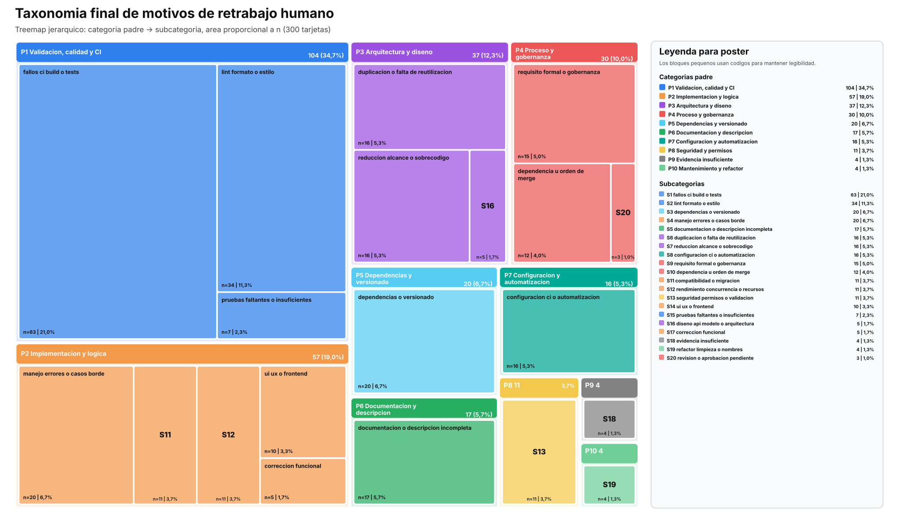
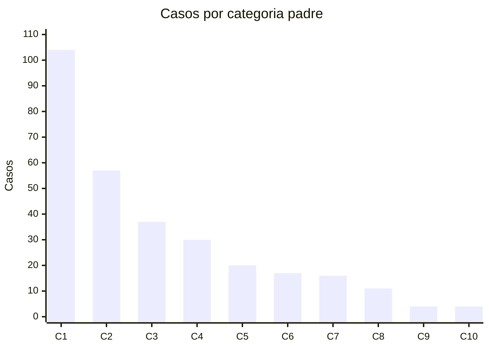

# Taxonomia final merged_after_rework

## Resumen

Se construye una taxonomia final de dos niveles para las 300 tarjetas `merged_after_rework`.
La categoria final usa Javier/Codex como base y Diego como contraste para estimar acuerdo,
discrepancias y prioridad de revision futura. Estos resultados son asistidos y deben
reportarse junto con sus limitaciones metodologicas.

## Cobertura

| Fuente | Filas | card_id unicos |
| --- | --- | --- |
| Javier/Codex | 300 | 300 |
| Diego validado | 300 | 300 |
| Solapamiento | 300 | 300 |

## Taxonomia final con conteos

| Categoria padre | n | % | Subcategorias |
| --- | --- | --- | --- |
| `validacion_calidad_ci` | 104 | 34,7% | `fallos_ci_build_o_tests` 63; `lint_formato_o_estilo` 34; `pruebas_faltantes_o_insuficientes` 7 |
| `implementacion_logica` | 57 | 19,0% | `manejo_errores_o_casos_borde` 20; `compatibilidad_o_migracion` 11; `rendimiento_concurrencia_o_recursos` 11; `ui_ux_o_frontend` 10; `correccion_funcional` 5 |
| `arquitectura_diseno` | 37 | 12,3% | `duplicacion_o_falta_de_reutilizacion` 16; `reduccion_alcance_o_sobrecodigo` 16; `diseno_api_modelo_o_arquitectura` 5 |
| `proceso_gobernanza` | 30 | 10,0% | `requisito_formal_o_gobernanza` 15; `dependencia_u_orden_de_merge` 12; `revision_o_aprobacion_pendiente` 3 |
| `dependencias_versionado` | 20 | 6,7% | `dependencias_o_versionado` 20 |
| `documentacion_descripcion` | 17 | 5,7% | `documentacion_o_descripcion_incompleta` 17 |
| `configuracion_automatizacion` | 16 | 5,3% | `configuracion_ci_o_automatizacion` 16 |
| `seguridad_permisos` | 11 | 3,7% | `seguridad_permisos_o_validacion` 11 |
| `mantenimiento_refactor` | 4 | 1,3% | `refactor_limpieza_o_nombres` 4 |
| `evidencia_insuficiente` | 4 | 1,3% | `evidencia_insuficiente` 4 |

## Subcategorias finales

| Categoria padre | Subcategoria | n | % | Acuerdo subcat. Diego | Acuerdo padre Diego |
| --- | --- | --- | --- | --- | --- |
| `validacion_calidad_ci` | `fallos_ci_build_o_tests` | 63 | 21,0% | 5 | 11 |
| `validacion_calidad_ci` | `lint_formato_o_estilo` | 34 | 11,3% | 14 | 17 |
| `validacion_calidad_ci` | `pruebas_faltantes_o_insuficientes` | 7 | 2,3% | 3 | 3 |
| `implementacion_logica` | `manejo_errores_o_casos_borde` | 20 | 6,7% | 2 | 3 |
| `implementacion_logica` | `compatibilidad_o_migracion` | 11 | 3,7% | 1 | 3 |
| `implementacion_logica` | `rendimiento_concurrencia_o_recursos` | 11 | 3,7% | 0 | 0 |
| `implementacion_logica` | `ui_ux_o_frontend` | 10 | 3,3% | 3 | 5 |
| `implementacion_logica` | `correccion_funcional` | 5 | 1,7% | 0 | 0 |
| `arquitectura_diseno` | `duplicacion_o_falta_de_reutilizacion` | 16 | 5,3% | 3 | 4 |
| `arquitectura_diseno` | `reduccion_alcance_o_sobrecodigo` | 16 | 5,3% | 7 | 8 |
| `arquitectura_diseno` | `diseno_api_modelo_o_arquitectura` | 5 | 1,7% | 0 | 1 |
| `proceso_gobernanza` | `requisito_formal_o_gobernanza` | 15 | 5,0% | 9 | 9 |
| `proceso_gobernanza` | `dependencia_u_orden_de_merge` | 12 | 4,0% | 2 | 2 |
| `proceso_gobernanza` | `revision_o_aprobacion_pendiente` | 3 | 1,0% | 0 | 0 |
| `dependencias_versionado` | `dependencias_o_versionado` | 20 | 6,7% | 6 | 6 |
| `documentacion_descripcion` | `documentacion_o_descripcion_incompleta` | 17 | 5,7% | 6 | 6 |
| `configuracion_automatizacion` | `configuracion_ci_o_automatizacion` | 16 | 5,3% | 5 | 5 |
| `seguridad_permisos` | `seguridad_permisos_o_validacion` | 11 | 3,7% | 1 | 1 |
| `evidencia_insuficiente` | `evidencia_insuficiente` | 4 | 1,3% | 1 | 1 |
| `mantenimiento_refactor` | `refactor_limpieza_o_nombres` | 4 | 1,3% | 2 | 2 |

## Recomendacion para poster

Para el poster, el formato recomendado es un treemap jerarquico de dos niveles:
las categorias padre funcionan como bloques principales y las subcategorias como
bloques internos. El area de cada bloque debe representar `n`, por lo que el lector
puede ver al mismo tiempo estructura taxonomica y peso relativo de cada motivo de
retrabajo.

Figura SVG generada para usar en poster:

Usar esta composicion:

| Rol en el poster | Formato recomendado | Proposito |
| --- | --- | --- |
| Visual principal | Treemap jerarquico categoria padre -> subcategoria | Mostrar taxonomia y volumen relativo en una sola figura compacta |
| Visual de apoyo | Barras horizontales por categoria padre | Comparar rapidamente el peso de las categorias principales |
| Detalle numerico | Tabla compacta con `n` y `%` | Conservar valores exactos para lectura academica |

Codificacion visual sugerida para el treemap:

| Elemento | Recomendacion |
| --- | --- |
| Bloque externo | Categoria padre |
| Bloque interno | Subcategoria |
| Area | Numero de tarjetas `n` |
| Etiqueta | Nombre corto, `n` y porcentaje |
| Color | Un color por categoria padre; tonos del mismo color para sus subcategorias |

El arbol Mermaid de este reporte sirve para explicar la estructura completa, pero
puede ocupar demasiado espacio en un poster. El Sankey no se recomienda como figura
principal porque aqui no hay una transicion entre estados, sino una jerarquia de
clasificacion.

## Diagrama de taxonomia

El diagrama principal recomendado es un arbol jerarquico de tres niveles visuales:
raiz de la muestra, categorias padre y subcategorias. Bajo cada subcategoria se agrega
una caja de entradas con el conteo absoluto y porcentaje sobre las 300 tarjetas. Este
formato sigue la lectura `categoria -> subcategoria -> entradas`, similar al esquema
visual usado en card sorting.

Colores sugeridos: raiz y categorias en azul, subcategorias en azul consistente y
entradas en celeste claro para separar conteos de conceptos.

```mermaid
flowchart TD
    root["PRs merged_after_rework<br/>300 entradas"]

    cat1["validacion_calidad_ci<br/>104 casos (34,7%)"]
    root --> cat1
    cat1_sub1["fallos_ci_build_o_tests"]
    cat1_sub1_entries["63 entradas<br/>21,0%"]
    cat1 --> cat1_sub1
    cat1_sub1 --> cat1_sub1_entries
    cat1_sub2["lint_formato_o_estilo"]
    cat1_sub2_entries["34 entradas<br/>11,3%"]
    cat1 --> cat1_sub2
    cat1_sub2 --> cat1_sub2_entries
    cat1_sub3["pruebas_faltantes_o_insuficientes"]
    cat1_sub3_entries["7 entradas<br/>2,3%"]
    cat1 --> cat1_sub3
    cat1_sub3 --> cat1_sub3_entries

    cat2["implementacion_logica<br/>57 casos (19,0%)"]
    root --> cat2
    cat2_sub1["manejo_errores_o_casos_borde"]
    cat2_sub1_entries["20 entradas<br/>6,7%"]
    cat2 --> cat2_sub1
    cat2_sub1 --> cat2_sub1_entries
    cat2_sub2["compatibilidad_o_migracion"]
    cat2_sub2_entries["11 entradas<br/>3,7%"]
    cat2 --> cat2_sub2
    cat2_sub2 --> cat2_sub2_entries
    cat2_sub3["rendimiento_concurrencia_o_recursos"]
    cat2_sub3_entries["11 entradas<br/>3,7%"]
    cat2 --> cat2_sub3
    cat2_sub3 --> cat2_sub3_entries
    cat2_sub4["ui_ux_o_frontend"]
    cat2_sub4_entries["10 entradas<br/>3,3%"]
    cat2 --> cat2_sub4
    cat2_sub4 --> cat2_sub4_entries
    cat2_sub5["correccion_funcional"]
    cat2_sub5_entries["5 entradas<br/>1,7%"]
    cat2 --> cat2_sub5
    cat2_sub5 --> cat2_sub5_entries

    cat3["arquitectura_diseno<br/>37 casos (12,3%)"]
    root --> cat3
    cat3_sub1["duplicacion_o_falta_de_reutilizacion"]
    cat3_sub1_entries["16 entradas<br/>5,3%"]
    cat3 --> cat3_sub1
    cat3_sub1 --> cat3_sub1_entries
    cat3_sub2["reduccion_alcance_o_sobrecodigo"]
    cat3_sub2_entries["16 entradas<br/>5,3%"]
    cat3 --> cat3_sub2
    cat3_sub2 --> cat3_sub2_entries
    cat3_sub3["diseno_api_modelo_o_arquitectura"]
    cat3_sub3_entries["5 entradas<br/>1,7%"]
    cat3 --> cat3_sub3
    cat3_sub3 --> cat3_sub3_entries

    cat4["proceso_gobernanza<br/>30 casos (10,0%)"]
    root --> cat4
    cat4_sub1["requisito_formal_o_gobernanza"]
    cat4_sub1_entries["15 entradas<br/>5,0%"]
    cat4 --> cat4_sub1
    cat4_sub1 --> cat4_sub1_entries
    cat4_sub2["dependencia_u_orden_de_merge"]
    cat4_sub2_entries["12 entradas<br/>4,0%"]
    cat4 --> cat4_sub2
    cat4_sub2 --> cat4_sub2_entries
    cat4_sub3["revision_o_aprobacion_pendiente"]
    cat4_sub3_entries["3 entradas<br/>1,0%"]
    cat4 --> cat4_sub3
    cat4_sub3 --> cat4_sub3_entries

    cat5["dependencias_versionado<br/>20 casos (6,7%)"]
    root --> cat5
    cat5_sub1["dependencias_o_versionado"]
    cat5_sub1_entries["20 entradas<br/>6,7%"]
    cat5 --> cat5_sub1
    cat5_sub1 --> cat5_sub1_entries

    cat6["documentacion_descripcion<br/>17 casos (5,7%)"]
    root --> cat6
    cat6_sub1["documentacion_o_descripcion_incompleta"]
    cat6_sub1_entries["17 entradas<br/>5,7%"]
    cat6 --> cat6_sub1
    cat6_sub1 --> cat6_sub1_entries

    cat7["configuracion_automatizacion<br/>16 casos (5,3%)"]
    root --> cat7
    cat7_sub1["configuracion_ci_o_automatizacion"]
    cat7_sub1_entries["16 entradas<br/>5,3%"]
    cat7 --> cat7_sub1
    cat7_sub1 --> cat7_sub1_entries

    cat8["seguridad_permisos<br/>11 casos (3,7%)"]
    root --> cat8
    cat8_sub1["seguridad_permisos_o_validacion"]
    cat8_sub1_entries["11 entradas<br/>3,7%"]
    cat8 --> cat8_sub1
    cat8_sub1 --> cat8_sub1_entries

    cat9["mantenimiento_refactor<br/>4 casos (1,3%)"]
    root --> cat9
    cat9_sub1["refactor_limpieza_o_nombres"]
    cat9_sub1_entries["4 entradas<br/>1,3%"]
    cat9 --> cat9_sub1
    cat9_sub1 --> cat9_sub1_entries

    cat10["evidencia_insuficiente<br/>4 casos (1,3%)"]
    root --> cat10
    cat10_sub1["evidencia_insuficiente"]
    cat10_sub1_entries["4 entradas<br/>1,3%"]
    cat10 --> cat10_sub1
    cat10_sub1 --> cat10_sub1_entries

    classDef root fill:#2f95d0,color:#ffffff,stroke:#1f6f9f,stroke-width:2px;
    classDef category fill:#3498db,color:#ffffff,stroke:#1f6f9f,stroke-width:2px;
    classDef subcategory fill:#3498db,color:#ffffff,stroke:#1f6f9f,stroke-width:2px;
    classDef entries fill:#e8f2f7,color:#111111,stroke:#6aa7c8,stroke-width:2px;
    class root root;
    class cat1 category;
    class cat1_sub1 subcategory;
    class cat1_sub1_entries entries;
    class cat1_sub2 subcategory;
    class cat1_sub2_entries entries;
    class cat1_sub3 subcategory;
    class cat1_sub3_entries entries;
    class cat2 category;
    class cat2_sub1 subcategory;
    class cat2_sub1_entries entries;
    class cat2_sub2 subcategory;
    class cat2_sub2_entries entries;
    class cat2_sub3 subcategory;
    class cat2_sub3_entries entries;
    class cat2_sub4 subcategory;
    class cat2_sub4_entries entries;
    class cat2_sub5 subcategory;
    class cat2_sub5_entries entries;
    class cat3 category;
    class cat3_sub1 subcategory;
    class cat3_sub1_entries entries;
    class cat3_sub2 subcategory;
    class cat3_sub2_entries entries;
    class cat3_sub3 subcategory;
    class cat3_sub3_entries entries;
    class cat4 category;
    class cat4_sub1 subcategory;
    class cat4_sub1_entries entries;
    class cat4_sub2 subcategory;
    class cat4_sub2_entries entries;
    class cat4_sub3 subcategory;
    class cat4_sub3_entries entries;
    class cat5 category;
    class cat5_sub1 subcategory;
    class cat5_sub1_entries entries;
    class cat6 category;
    class cat6_sub1 subcategory;
    class cat6_sub1_entries entries;
    class cat7 category;
    class cat7_sub1 subcategory;
    class cat7_sub1_entries entries;
    class cat8 category;
    class cat8_sub1 subcategory;
    class cat8_sub1_entries entries;
    class cat9 category;
    class cat9_sub1 subcategory;
    class cat9_sub1_entries entries;
    class cat10 category;
    class cat10_sub1 subcategory;
    class cat10_sub1_entries entries;
```

## Diagrama de barras por categoria padre

El segundo diagrama resume la cantidad de tarjetas por categoria padre. Sirve como
visual compacto para informe o poster cuando el arbol completo resulta demasiado
extenso. Para evitar etiquetas sobrepuestas, el eje X usa codigos cortos y la
leyenda conserva los nombres completos de las categorias.

Leyenda del grafico de barras:

| Codigo | Categoria padre | n | % |
| --- | --- | --- | --- |
| C1 | `validacion_calidad_ci` | 104 | 34,7% |
| C2 | `implementacion_logica` | 57 | 19,0% |
| C3 | `arquitectura_diseno` | 37 | 12,3% |
| C4 | `proceso_gobernanza` | 30 | 10,0% |
| C5 | `dependencias_versionado` | 20 | 6,7% |
| C6 | `documentacion_descripcion` | 17 | 5,7% |
| C7 | `configuracion_automatizacion` | 16 | 5,3% |
| C8 | `seguridad_permisos` | 11 | 3,7% |
| C9 | `mantenimiento_refactor` | 4 | 1,3% |
| C10 | `evidencia_insuficiente` | 4 | 1,3% |

Como fallback textual para informe o poster, usar barras horizontales por categoria
padre junto con la tabla de subcategorias:

| Categoria padre | n | % | Barra relativa |
| --- | --- | --- | --- |
| `validacion_calidad_ci` | 104 | 34,7% | ████████████████████████ |
| `implementacion_logica` | 57 | 19,0% | █████████████ |
| `arquitectura_diseno` | 37 | 12,3% | █████████ |
| `proceso_gobernanza` | 30 | 10,0% | ███████ |
| `dependencias_versionado` | 20 | 6,7% | █████ |
| `documentacion_descripcion` | 17 | 5,7% | ████ |
| `configuracion_automatizacion` | 16 | 5,3% | ████ |
| `seguridad_permisos` | 11 | 3,7% | ███ |
| `mantenimiento_refactor` | 4 | 1,3% | █ |
| `evidencia_insuficiente` | 4 | 1,3% | █ |

## Contraste con Diego

| Metrica | Valor |
| --- | --- |
| Acuerdo exacto de subcategoria | 70 |
| Acuerdo de categoria padre | 87 |
| Discrepancia de categoria padre | 213 |
| Casos de prioridad alta de revision | 49 |

Distribucion de tipos de contraste:

| Tipo de contraste | Casos |
| --- | --- |
| discrepancia | 200 |
| acuerdo_total | 70 |
| acuerdo_padre | 17 |
| evidencia_insuficiente | 13 |

Distribucion de prioridad de revision:

| Prioridad | Casos |
| --- | --- |
| media | 234 |
| alta | 49 |
| baja | 17 |

### Top discrepancias por subcategoria

| Subcategoria final Javier/Codex | Subcategoria Diego | Casos |
| --- | --- | --- |
| `fallos_ci_build_o_tests` | `documentacion_o_descripcion_incompleta` | 16 |
| `fallos_ci_build_o_tests` | `diseno_api_modelo_o_arquitectura` | 9 |
| `fallos_ci_build_o_tests` | `requisito_formal_o_gobernanza` | 7 |
| `lint_formato_o_estilo` | `documentacion_o_descripcion_incompleta` | 6 |
| `manejo_errores_o_casos_borde` | `lint_formato_o_estilo` | 5 |
| `fallos_ci_build_o_tests` | `configuracion_ci_o_automatizacion` | 5 |
| `manejo_errores_o_casos_borde` | `documentacion_o_descripcion_incompleta` | 5 |
| `fallos_ci_build_o_tests` | `lint_formato_o_estilo` | 5 |
| `dependencias_o_versionado` | `documentacion_o_descripcion_incompleta` | 5 |
| `seguridad_permisos_o_validacion` | `documentacion_o_descripcion_incompleta` | 5 |
| `fallos_ci_build_o_tests` | `seguridad_permisos_o_validacion` | 4 |
| `fallos_ci_build_o_tests` | `ui_ux_o_frontend` | 3 |

### Casos de prioridad alta

| card_id | Javier/Codex | Diego | conf. Diego | veredicto Diego |
| --- | --- | --- | --- | --- |
| 2941643405-A | `dependencias_o_versionado` | `lint_formato_o_estilo` | alta | si |
| 2958369170-A | `duplicacion_o_falta_de_reutilizacion` | `manejo_errores_o_casos_borde` | alta | si |
| 2958441612-A | `manejo_errores_o_casos_borde` | `lint_formato_o_estilo` | alta | si |
| 2968159813-A | `compatibilidad_o_migracion` | `reduccion_alcance_o_sobrecodigo` | alta | si |
| 2971120661-A | `fallos_ci_build_o_tests` | `compatibilidad_o_migracion` | alta | si |
| 3019945406-A | `fallos_ci_build_o_tests` | `seguridad_permisos_o_validacion` | alta | si |
| 3021989795-A | `fallos_ci_build_o_tests` | `documentacion_o_descripcion_incompleta` | alta | si |
| 3029374639-A | `compatibilidad_o_migracion` | `correccion_funcional` | alta | si |
| 3067433888-A | `fallos_ci_build_o_tests` | `seguridad_permisos_o_validacion` | alta | si |
| 3078006902-A | `duplicacion_o_falta_de_reutilizacion` | `correccion_funcional` | alta | si |
| 3098739033-A | `dependencia_u_orden_de_merge` | `pruebas_faltantes_o_insuficientes` | alta | si |
| 3104405109-A | `pruebas_faltantes_o_insuficientes` | `diseno_api_modelo_o_arquitectura` | alta | si |
| 3105630972-A | `rendimiento_concurrencia_o_recursos` | `fallos_ci_build_o_tests` | alta | si |
| 3113332396-A | `duplicacion_o_falta_de_reutilizacion` | `reduccion_alcance_o_sobrecodigo` | alta | si |
| 3114898378-A | `duplicacion_o_falta_de_reutilizacion` | `configuracion_ci_o_automatizacion` | alta | si |
| 3115119469-A | `documentacion_o_descripcion_incompleta` | `lint_formato_o_estilo` | alta | si |
| 3115762277-A | `dependencia_u_orden_de_merge` | `pruebas_faltantes_o_insuficientes` | alta | si |
| 3119688458-A | `configuracion_ci_o_automatizacion` | `correccion_funcional` | alta | si |
| 3125790678-A | `reduccion_alcance_o_sobrecodigo` | `pruebas_faltantes_o_insuficientes` | alta | si |
| 3130792767-A | `requisito_formal_o_gobernanza` | `correccion_funcional` | alta | si |

## Decision metodologica

La base final se toma desde Javier/Codex porque no se alcanzo a realizar una validacion
manual completa adicional. Diego se usa como una validacion contrastiva: no reemplaza
automaticamente la categoria final, pero permite identificar acuerdos, discrepancias y
casos de revision prioritaria.

## Limitaciones

- La clasificacion Javier/Codex es asistida y mantiene decisiones humanas pendientes.
- La validacion de Diego contiene muchos casos `no_determinable`, por lo que no debe
  interpretarse como consenso cerrado.
- Cada tarjeta queda asignada a una sola subcategoria principal, aunque puede contener
  multiples motivos de retrabajo.
- La taxonomia final es apta para reportar distribuciones y orientar discusion, pero
  debe presentarse como resultado asistido y no como acuerdo interevaluador definitivo.
